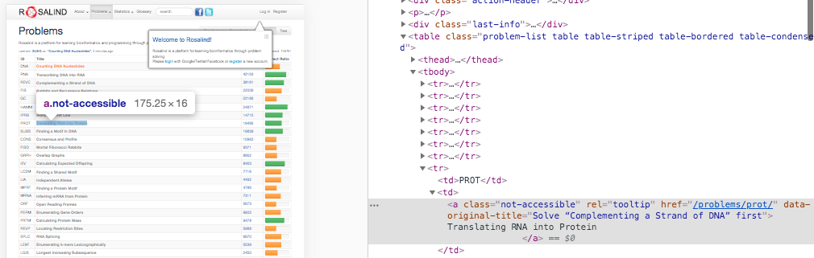
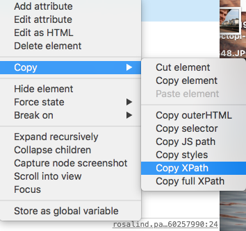

# Web Scraping Demo with Python

This was a project used to take selected data-points from designated websites, clean the data, and then output the data in a more intuitive way for the user. This process is known as web scraping or web crawling. Essentially a program travels to different URL's and then takes the most pertinent data from them. Once that data is collected, then one is able to reformat and display it in a different way.

## Project Details
In 2018, [recreation.gov](https://www.recreation.gov/) was a sorry mess of a website to try and campsites. One would have to do a lot of work just to sift through poorly optimized campsite searches and then have no way to compare different sites without having 14 tabs open. This inspired me to make a web scraper to find all of the same details (e.g. name, location, description, phone number, etc) and then output it to a single document. That program is named `campsites.py` and you can see what output was generated in `sample-campsites-output.py`.

#### This program is for illustrative purposes only, because...
since 2018, recreation.gov spent a lot of dough on building a much better website (including dropping the www subdomain entirely). Because of this, all of the URL's in this code are broken, and don't return values at all because those pages no longer exist! Alas... web scraping is only a solution for as long as the site's data doesn't shift around. A more robust solution would be to use a service's **Application Programming Interface (API)**.

## A Whole Lotta XPath
Finding specific information is based on a web page's HTML hierarchy and sifting through dozens of nested tags like `
This string.
`. **XPath** is a necessary tool to navigate this frankly overwhelming tree structure.

#### How to Find XPath of a Webpage's Element
1. Open Developer Tools on a browser (e.g. Chrome, Firefox).

2. Find element of data you want, right click and Copy XPath.

3. XPath should look similar to this: `/html/body/div[3]/table/tbody/tr[8]/td[2]`. You'll see in `campsites.py` how I use a Python library to operate on these XPath's and then return their data.

## Map Generation
The `gmplot.py` file was an add-on to the original project. Gmplot is a useful library that takes GPS coordinates as input and then places pins on a generated [OpenStreetMap](https://www.openstreetmap.org/). You can view the sample output (with me adding color-coding and routes manually) below:

##### P.S. We ended up going to Alvarado Campground in the Sangre de Cristo mountain range. It was excellent!
